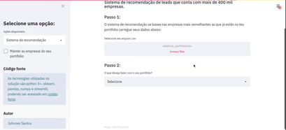

<h1 align="center">RecommenderNation</h3>

Projeto realizado na aceleração data science [codenation](https://www.codenation.dev/) com a proposta de ser um sistema recomendador, onde qualquer usuário com um portifolio pudesse submete-lo e ter empresas mais aderentes no mercado.


<p align="center"> </p>

<p align="center">
    <a href="#readme">
        
    </a>
</p>

## Ambiente
A preparação do ambiente se dá com os comandos abaixo, por recomendação é preferivel utilizar ambientes virtuais. [Ler mais...](https://docs.python.org/3/library/venv.html)
```bash
$ python -m venv "codenationvenv"
$ source codenationvenv/bin/activate
$ pip install -r requirements.txt
```

Com o modelo baixado `output/modelo.pkl` basta rodar o comando:
```bash
$ streamlit run src/app.py
```

Caso contrario:
```bash
$ python src/main.py
$ streamlit run src/app.py
```